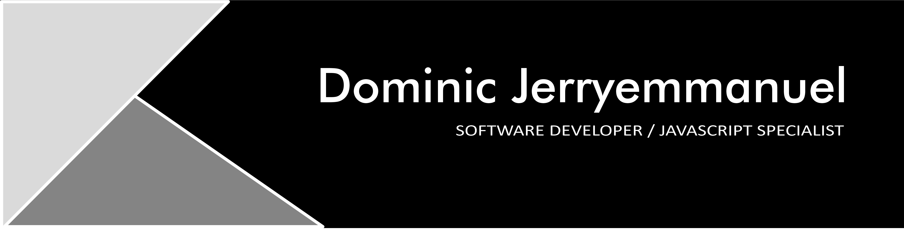

  
  
  
  

A Mern-Stack Software Developer and Tech Enthusiast, I am motivated by the power of technology as a tool for positive change, with a knack for turning ideas into reality, backed by a solid Computer Science Background.

See [my website](https://github.com/Jerryemmanuel01) for more information!

<h1 align="center">Projects</h1>

<table bordercolor="#66b2b2">
  <tr>
    <td width="50%" valign="top">
      <h3 align="center">Horizon Bank</h3>
         
        
         
        

          
    
  
      

        
<strong>Next.js, Typescript, Shadcn UI, Tailwind CSS, Appwrite, Sentry, Plaid, Dwolla</strong> - Horizon is a modern banking platform for everyone. A banking app build with modern technologies such as nextjs typescript and others which help perform seamless banking transaction throughout the application. 

    </td>
     <td width="50%"  valign="top">
      <h3 align="center">Admin Dashborad</h3>
         
        
         
        

          
  
  
      

        
<strong>React.js, Typescript, Material UI, SCSS, React-Query, Node.js & Express.js</strong> - An admin dashboard built with react, typescript and scss for fetching all user data to the admin. It has a great UI and very responsive across all devices. 

    </td>
    
  </tr>

  <tr>
    <td width="50%" valign="top">
      <h3 align="center">Cruise Trips</h3>
       
        
       
        

  
  
      

        
<strong>React.js, SCSS, Material UI, REST API</strong> - Cruise-trips is a travel advisor web application, that will render hotels, restaurants and site search for any city of your choice.

    </td>
     <td width="5%" valign="top" >
      <h3 align="center">Dab Daddy</h3>
         
       
         
        

          
  
  
      

        
<strong>React.js Tailwind, Framer-motion</strong> - A web app showing the details of a web3 based project for credibility and authenticity.

    </td>
   
  </tr>
</table>

<h1 align="center">Technologies</h1>

    
    
    
    
    
    
    
   
   
    
    
   
    
   
    
    
    

---

<h1 align="center">Connect</h1>

  
  
  <a href="https://x.com/Jerryemmanuel65" target="_blank">
    
  

